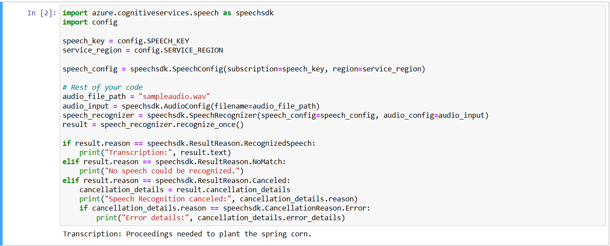
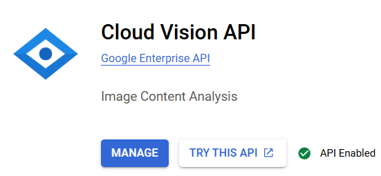
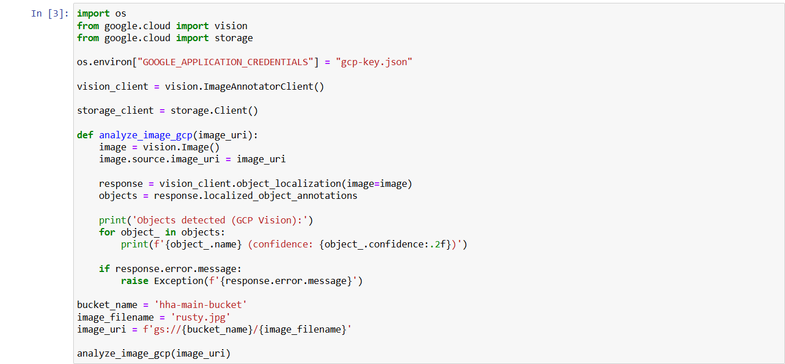
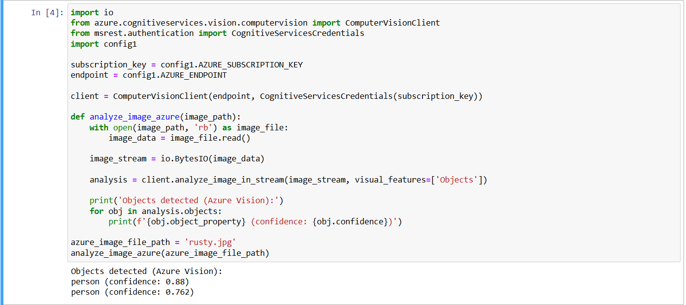

# Exploring AI and Analytics with Pre-trained Models in Azure and GCP

## Objective

The objective of this assignment is to explore and use pre-trained machine learning models in both Azure and Google Cloud Platform (GCP). Through this, we aim to gain experience with cloud-based tools, particularly in the domains of speech and vision processing.

## 1. Work with Pre-trained Speech Models

### GCP Speech-to-Text

1.  **Accessing Vertex AI Notebooks**
    
    -   Logged into GCP and accessed Vertex AI Notebooks.
    -   Set up a pre-configured notebook specifically for interacting with the GCP Speech-to-Text API.
        
2.  **Transcribing an Audio File**
    
    -   Uploaded a sample audio file for testing.
    -   Used the Speech-to-Text API to perform transcription and documented the process and results.
    

### Azure Speech-to-Text

1.  **Access Azure Machine Learning (AML)**: In Azure, go to the Azure Machine Learning workspace.
2.  **Set Up the Speech-to-Text API**:
    -   Open a new or existing notebook in Azure and import the required Azure Speech SDK.
    -   Configure the subscription key and endpoint for the Speech-to-Text API.
3.  **Upload and Transcribe Audio**:
    -   Load a sample audio file into the notebook.
    -   Use the `speech_recognition` method from the SDK to transcribe the audio.
    
  
   

## 2. Work with Pre-trained Vision Models

### GCP Vision API

1.  **Enabling Vision API**
    
    -   Accessed GCP Vision API through Vertex AI Notebooks.
    -   Enabled the API for object and text detection.
    

    
2.  **Image Upload and Analysis**
    
    -   Uploaded an image and used the Vision API for object detection.
    -   Observed and documented the detected objects and/or text, along with a brief analysis.
   
    
    **Analysis of Results**  
    _The model accurately detected objects in the image, showing high precision for recognized items. However, there were some limitations in recognizing smaller or partially obscured items. Overall, the API provided consistent results for clear and high-resolution images._
    

### Azure AI Vision

1.  **Accessing Azure Machine Learning Notebooks**
    
    -   Logged into Azure and accessed Azure Machine Learning (AML) Notebooks.
    -   Set up a notebook to work with Azure’s pre-trained vision models.
2.  **Using Pre-trained Vision Model**
    
    -   Uploaded a similar image as in the GCP test to perform object detection.
    -   Ran the Azure AI Vision model for comparison with GCP Vision API.
    
    
    
   **Analysis of Results**  
    _Azure AI Vision demonstrated similar detection capabilities as the GCP Vision API. However, Azure’s model showed slightly different accuracy in certain scenarios, such as recognizing partially obscured items. Both models were effective for clear images, though Azure's model handled shadowed regions with more sensitivity._
    

## Comparison and Reflection

-   **Speech Models**: Both Azure and GCP speech models performed transcription with high accuracy and processed audio files efficiently.
-   **Vision Models**: GCP and Azure vision models displayed comparable accuracy, with Azure having a slight edge in handling certain challenging conditions, such as shadowed regions or low contrast.

### Reflections on Ease of Use

-   **GCP**: The interface for the Vertex AI Notebooks is straightforward, and both Speech and Vision APIs integrate seamlessly. The initial setup was smooth, though enabling certain APIs required additional permissions.
-   **Azure**: The AML Notebooks are also user-friendly, though setting up a new instance required more steps than GCP. Azure’s documentation on using pre-trained models is comprehensive, aiding in the workflow.

### Challenges and Resolutions

-   **Enabling APIs**: In GCP, enabling the Vision API took additional time due to permission requirements. Ensuring proper billing was activated resolved access issues.
-   **Object Detection Consistency**: Both platforms occasionally struggled with recognizing obscured or shadowed objects. Adjusting image quality (resolution, lighting) before upload improved detection consistency.

----------

## Conclusion

This assignment provided hands-on experience with pre-trained AI models across two major cloud platforms. With minor differences in model sensitivity and usability, GCP and Azure both showed dependable performance in voice and vision tests. These details are helpful for choosing the right platform for a certain project's demands and technical specifications. To sum up, MongoDB Atlas, Redis, and GCP BigQuery offer strong tools for data analysis and No-SQL database administration. Every platform has distinct characteristics that meet diverse requirements, which makes them appropriate for a range of data management jobs. Redis is excellent for quick, in-memory data handling, MongoDB Atlas is excellent for ease of setup and monitoring, and GCP BigQuery is excellent for data analysis. User preferences and particular project requirements play a major role in selecting one of these platforms.
