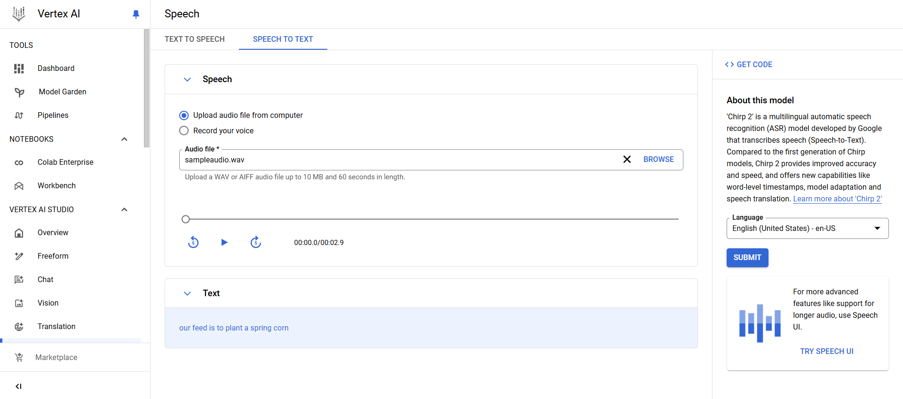

# Exploring AI and Analytics with Pre-trained Models in Azure and GCP

## Objective

This assignment's goal is to investigate and use pre-trained machine learning models on Google Cloud Platform (GCP) and Azure. We hope to learn more about cloud-based tools through this, especially in the areas of voice and visual processing.

## 1. Work with Pre-trained Speech Models

### GCP Speech-to-Text

1.  **Accessing Vertex AI Notebooks**
    
    -   Logged into GCP and accessed Vertex AI Studio.
    -   Set up a pre-configured notebook specifically for interacting with the GCP Speech-to-Text.
        
2.  **Transcribing an Audio File**
    
    -   Uploaded a sample audio file for testing.
    -   Used the Speech-to-Text to perform transcription and documented the process and results.
    

### Azure Speech-to-Text

1.  **Access Azure Machine Learning (AML)**: In Azure, go to the Azure Machine Learning workspace.
2.  **Set Up the Speech-to-Text API**:
    -   Open a new or existing notebook in Azure and import the required Azure Speech SDK.
    -   Configure the subscription key and endpoint for the Speech-to-Text API.
3.  **Upload and Transcribe Audio**:
    -   Load a sample audio file into the notebook.
    -   Use the `speech_recognition` method from the SDK to transcribe the audio.
    
  
   

## 2. Work with Pre-trained Vision Models

### GCP Vision API

1.  **Enabling Vision API**
    
    -   Accessed GCP Vision API through Vertex AI Notebooks.
    -   Enabled the API for object and text detection.
    

    
2.  **Image Upload and Analysis**
    
    -   Uploaded an image and used the Vision API for object detection.
    -   Observed and documented the detected objects and/or text, along with a brief analysis.
   
    
    **Analysis of Results**  
    _The model demonstrated a high degree of precision when identifying things in the image. The ability to identify tiny or partially veiled objects was limited, too. All things considered, the API consistently produced crisp, high-resolution photos._
    

### Azure AI Vision

1.  **Accessing Azure Machine Learning Notebooks**
    -   Logged into Azure and accessed Azure Machine Learning (AML) Notebooks.
    -   Set up a notebook to work with Azure’s pre-trained vision models.
2.  **Using Pre-trained Vision Model**
    
    -   Uploaded a similar image as in the GCP test to perform object detection.
    -   Ran the Azure AI Vision model for comparison with GCP Vision API.
    
    
    
   **Analysis of Results**  
    _The detection skills of the GCP Vision API and Azure AI Vision were comparable. However, in some situations, such identifying partially veiled objects, Azure's model demonstrated somewhat different accuracy. For clear photographs, both models worked well, although Azure's model was more sensitive to shadowy areas._
    

## Comparison and Reflection

-   **Speech Models**: The speech models from Azure and GCP handled audio files effectively and completed transcriptions with high accuracy.
-   **Vision Models**: The accuracy of the GCP and Azure vision models was similar, with Azure's model handling some difficult situations (such low contrast or shaded areas) a little better.

### Reflections on Ease of Use

-   **GCP**: The Vertex AI Notebooks have an easy-to-use UI, and the Speech and Vision APIs work together flawlessly. The first setup went smoothly, however extra permissions were needed to enable several APIs.
-   **Azure**: Although there are more steps involved in starting up a new instance than with GCP, the AML Notebooks are equally easy to utilize. Azure provides thorough instructions on how to use pre-trained models, which facilitates workflow.

### Challenges and Resolutions

-   **Enabling APIs**: Because of authorization constraints, it took longer to enable the Vision API in GCP. Access problems were fixed by making sure the correct billing was enabled.
-   **Object Detection Consistency**: On occasion, both platforms had trouble identifying items that were shadowed or occluded. The consistency of detection was increased by adjusting the image quality (lighting, resolution) prior to upload.

----------

## Conclusion

This assignment provided hands-on experience with pre-trained AI models across two major cloud platforms. With minor differences in model sensitivity and usability, GCP and Azure both showed dependable performance in voice and vision tests. These details are helpful for choosing the right platform for a certain project's demands and technical specifications. To sum up, MongoDB Atlas, Redis, and GCP BigQuery offer strong tools for data analysis and No-SQL database administration. Every platform has distinct characteristics that meet diverse requirements, which makes them appropriate for a range of data management jobs. Redis is excellent for quick, in-memory data handling, MongoDB Atlas is excellent for ease of setup and monitoring, and GCP BigQuery is excellent for data analysis. User preferences and particular project requirements play a major role in selecting one of these platforms.
